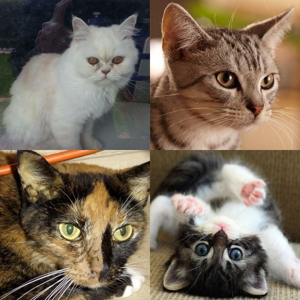

# deeplearning-course
deeplearning.ai course by Andrew NG. Its about simple logistic regression and neural networks implementation using python numpy .

## problem statement
Build the model such that it can classify cat or non-cat.

| Cat     | Non-cat    |
| --------|---------|
|  |    |

## Dataset
Dataset size

## Models
* [Logistic Regression](1_logistic_regression).
* [Neural Networks with one hidden layer](2_neural_network).
* [L_layer Neural Networks](3_deep_neural_networks)

## Setup


```
$ git clone https://github.com/pallavi2146/deeplearning-course.git
$ cd deeplearning-course
$ make install # creats virtual environment and install needed libraries and packages.
$ source env/bin/activate # activates virtual environment
```
