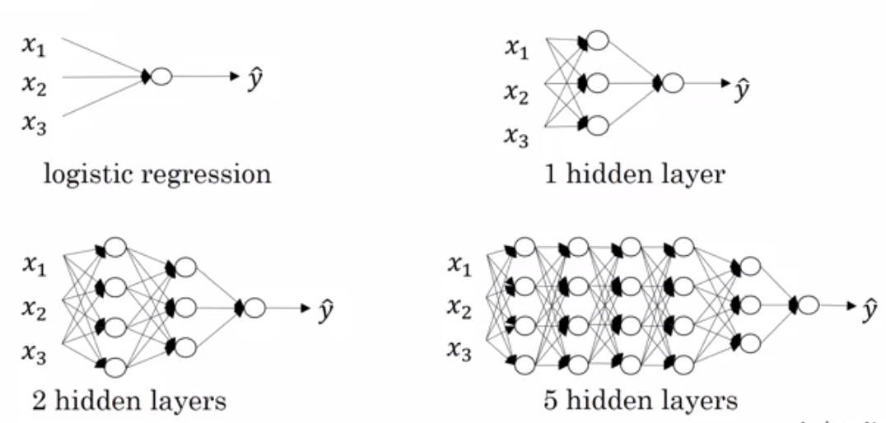

# Deeplearning
[deeplearning.ai](https://www.deeplearning.ai/) course-1 by Andrew NG. Its about simple Logistic Regression and Neural Networks implementation using python.

## Problem statement
Build the model such that it can classify ```cat``` or ```non-cat```.

| Cat     | Non-cat    |
| --------|---------|
|  |    |

## Dataset
Dataset size

## Models
* [Logistic Regression](1_logistic_regression).
* [Neural Networks with one hidden layer](2_neural_network).
* [L_layer Neural Networks](3_deep_neural_networks)

## Architectures
 


## Setup
```
$ git clone https://github.com/pallavi2146/deeplearning-course.git
$ cd deeplearning-course
$ make install # creats virtual environment and install needed libraries and packages.
$ source env/bin/activate # activates virtual environment
$ # run one of the bellow commands
$ python 1_logistic_regression/logistic_regression.py
$ python 2_neural_network/neural_network_one_hidden_layer.py
$ python 3_deep_neural_network/deep_neural_network.py
```
